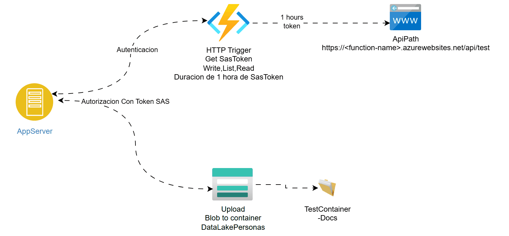

# upload-blob-azurestorage
Subir archivos a Azure Blob Container 

# Introduccion 
Repositorio que almacena un pequeno ejemplo de como interactuar con Azure Storage Blob Container
Usando los token SAS de firma compartida, un ejemplo sera de manera mas basica que la otra, Ademas
Se utiliza La Api Rest de Storage Account para subir archivos a este

1- normal : <a href="normal-upload.py">metodo normal</a>
 
2- robusto : <a href="robusto-upload.py">metodo robusto</a>

# Ejemplo de interaccion de diagrama Arquitectura

# Contribucion

1. Microsoft REST API REFERENCE : https://learn.microsoft.com/en-us/rest/api/storageservices/
2. PUT method para subir archivos : https://learn.microsoft.com/en-us/rest/api/storageservices/put-blob?tabs=microsoft-entra-id
